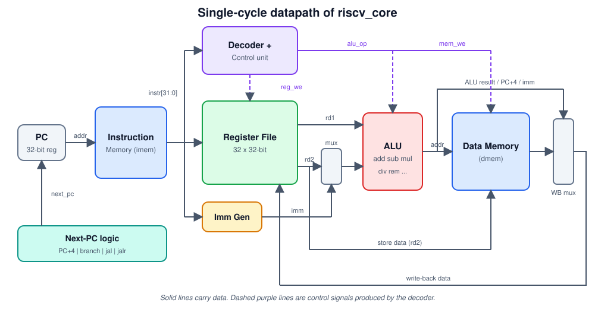

# RISC-V Core: a single-cycle 32-bit CPU in Verilog

A small, readable **RISC-V processor core** (RV32I + M extension) written in Verilog. It executes every instruction in **one clock cycle** and can do all the basic arithmetic: **add, subtract, multiply, divide and remainder**, plus logic, shifts, comparisons, branches, jumps and word loads and stores.

It is built for learning and for explaining. The whole CPU is one short file, with a testbench, a test program, and diagrams you can use in a presentation.



## Read the guides

| Guide | What it covers |
|---|---|
| [**Part 1: From idea to chip**](RISC-V-Core/docs/Idea_toChip.md) | The full journey of making a core: specification, architecture, Verilog, simulation, synthesis, FPGA / ASIC, and the final chip |
| [**Part 2: The core explained**](RISC-V-Core/docs/02-core-explained.md) | Every module, the instruction formats, the control signals, the branch logic and the test program, all with diagrams |
| [**Presentation outline**](RISC-V-Core/docs/Outline_explained.md) | A slide-by-slide plan for a talk, with the diagram to use on each slide and likely questions with answers |

## What is in this repository

```
.
├── README.md                     You are here
├── rtl/
│   └── riscv_core.v              The processor (all hardware modules)
├── tb/
│   └── tb_riscv_core.v           Testbench that checks the results
├── program.hex                   Test program in machine code
└── docs/
    ├── 01-from-idea-to-chip.md   Part 1
    ├── 02-core-explained.md      Part 2
    ├── 03-presentation-outline.md
    └── images/                   Diagrams (SVG)
```

| File | Purpose |
|---|---|
| `rtl/riscv_core.v` | The CPU. Contains the `alu`, `regfile`, `imem`, `dmem` and top-level `riscv_core` modules |
| `tb/tb_riscv_core.v` | Starts the clock and reset, runs the program, and prints PASS or FAIL for each register |
| `program.hex` | 12 RISC-V instructions that add, subtract, multiply and divide 20 and 6, store and reload a value, then stop. The core loads it at start-up |
| `docs/` | The guides and diagrams |

## What the core can do

| Group | Instructions |
|---|---|
| Add / subtract | `add`, `sub`, `addi` |
| Multiply | `mul`, `mulh`, `mulhsu`, `mulhu` |
| Divide / remainder | `div`, `divu`, `rem`, `remu` (with the RISC-V rules for divide by zero) |
| Logic and shifts | `and`, `or`, `xor`, `sll`, `srl`, `sra` and their immediate forms |
| Compare | `slt`, `sltu`, `slti`, `sltiu` |
| Memory | `lw`, `sw` |
| Branch / jump | `beq`, `bne`, `blt`, `bge`, `bltu`, `bgeu`, `jal`, `jalr` |
| Upper immediate | `lui`, `auipc` |

## Quick start

**1. Install the free tools**

| System | Command |
|---|---|
| Ubuntu / Debian | `sudo apt install iverilog gtkwave` |
| macOS (Homebrew) | `brew install icarus-verilog gtkwave` |
| Windows | Install Icarus Verilog and GTKWave, or use WSL with the Ubuntu command |

**2. Run the simulation** from the repository folder (the program is read from `program.hex` in the current folder):

```bash
iverilog -g2012 -o sim rtl/riscv_core.v tb/tb_riscv_core.v
vvp sim
```

**3. Expected output**

```
PASS: x1 = 20
PASS: x2 = 6
PASS: x3 = 26
PASS: x4 = 14
PASS: x5 = 120
PASS: x6 = 3
PASS: x7 = 2
PASS: x8 = 26
PASS: x9 = 28
PASS: x10 = -1

ALL TESTS PASSED
```

**4. See the waveforms (optional)**

```bash
gtkwave core.vcd
```

Add `dut.pc`, `dut.instr`, `dut.alu_y`, `dut.reg_we` and `dut.wb_data` to watch the single-cycle behaviour.

## Try your own program

`program.hex` is plain text: one 32-bit instruction in hexadecimal per line, starting at address 0. If you have the RISC-V GNU toolchain you can assemble your own:

```asm
# prog.s
    addi x1, x0, 100
    addi x2, x0, 7
    mul  x3, x1, x2      # 700
    div  x4, x3, x2      # 100
done:
    j done               # always end with an infinite loop
```

```bash
riscv64-unknown-elf-as -march=rv32im -mabi=ilp32 -o prog.o prog.s
riscv64-unknown-elf-ld -m elf32lriscv -Ttext=0 -o prog.elf prog.o
riscv64-unknown-elf-objcopy -O binary prog.elf prog.bin
od -An -v -tx4 -w4 prog.bin | tr -d ' ' > program.hex
```

Then update the expected values in `tb/tb_riscv_core.v`.

## Status and limitations

* The design and testbench are written and the expected results are documented. Run the simulation above to confirm `ALL TESTS PASSED` on your machine.
* Only word loads and stores (`lw`, `sw`) are implemented. There are no interrupts, CSRs or system instructions.
* Instruction and data memory are 1 KB each.
* A single-cycle design has a slow clock, mostly because of divide. See [Part 1](RISC-V-Core/docs/01-from-idea-to-chip.md) for what it takes to go from here to an FPGA or a chip.

## License

No license has been chosen yet. Before sharing the project widely, add a `LICENSE` file (for example MIT) so others know how they may use the code.
