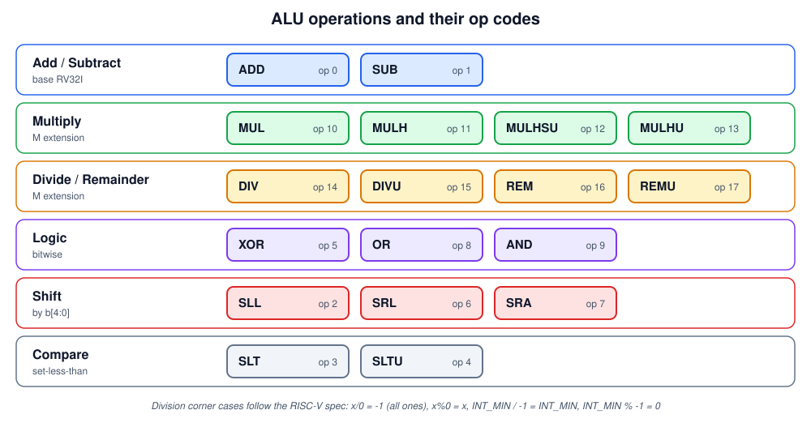
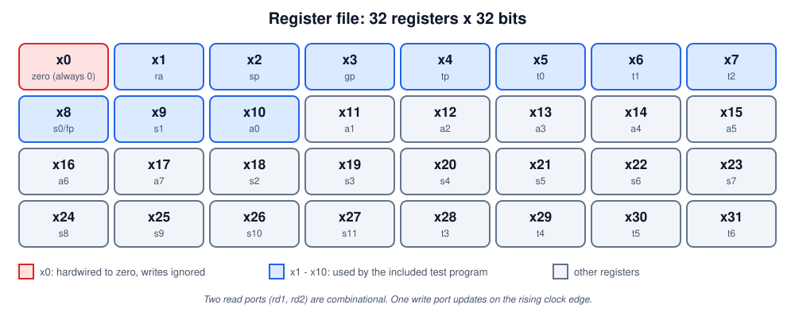
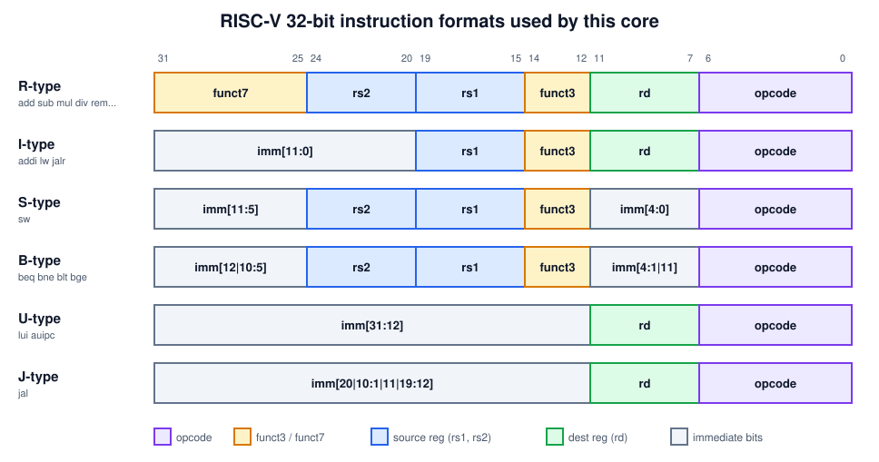

# Part 2: The core explained in detail

This guide explains everything inside the core: what each module does, how an instruction is decoded and executed, and how the pieces connect. It uses the diagrams you can reuse in a presentation.

**Contents**

1. [Features](#features)
2. [How a CPU core works](#how-a-cpu-core-works-quick-idea)
3. [Architecture](#architecture)
4. [The modules in detail](#the-modules-in-detail)
5. [Instruction formats and decoding](#instruction-formats-and-decoding)
6. [Supported instructions](#supported-instructions)
7. [Control signals](#control-signals)
8. [Next-PC logic](#next-pc-logic-branches-and-jumps)
9. [The test program](#the-test-program)
10. [Limitations](#limitations)

---

## Features

| Area | What is implemented |
|---|---|
| Base ISA | **RV32I** integer instructions: add, sub, logic, shifts, compare, immediates, `lui`, `auipc` |
| Extension | **M extension**: `mul`, `mulh`, `mulhsu`, `mulhu`, `div`, `divu`, `rem`, `remu` |
| Control flow | `beq`, `bne`, `blt`, `bge`, `bltu`, `bgeu`, `jal`, `jalr` |
| Memory | `lw` and `sw` (word access), separate instruction and data memory (Harvard style) |
| Timing | **Single cycle**: fetch, decode, execute, memory and write-back all happen in one clock |
| Registers | 32 x 32-bit register file, `x0` hardwired to zero |
| Verification | Self-checking testbench that prints PASS / FAIL per register |

**39 instructions** in total. Division follows the RISC-V rules for divide-by-zero and overflow.

---

## How a CPU core works (quick idea)

A processor repeats the same loop forever:

1. Look at the **program counter (PC)**. It holds the address of the next instruction.
2. **Fetch** the 32-bit instruction stored at that address.
3. **Decode** it. Which operation is it? Which registers does it use?
4. **Execute** it using the ALU (the calculator).
5. Read or write **memory** if needed.
6. **Write the result** into a register.
7. Update the PC (usually PC + 4, or somewhere else for a branch or jump) and repeat.

In this core, steps 1 to 6 all happen **combinationally inside one clock cycle**. On the next rising clock edge, the PC and the register file / data memory are updated together.


---

## Architecture

The core is made of four small building blocks and one top module that wires them together.


| Module | Job | Size |
|---|---|---|
| `alu` | The calculator: arithmetic, logic, shifts, comparisons | combinational |
| `regfile` | 32 fast storage slots, 2 read ports and 1 write port | 32 x 32 bit |
| `imem` | Holds the program, loaded from `program.hex` | 256 words (1 KB) |
| `dmem` | Holds data for `lw` / `sw` | 256 words (1 KB) |
| `riscv_core` | Top: PC, decoder, control unit, immediate generator, branch comparator, next-PC logic | - |

The datapath diagram at the top shows how data flows between them. Solid lines carry data. Dashed purple lines are **control signals** that the decoder produces to tell the other blocks what to do for the current instruction.

---

## The modules in detail

### `alu`: the calculator

Inputs: operands `a` and `b`, a 5-bit operation code `op`. Output: result `y`.



Key points:

* **Add / subtract** use the plain `+` and `-` operators.
* **Multiply** computes the full 64-bit product. `MUL` returns the low 32 bits. `MULH`, `MULHSU` and `MULHU` return the high 32 bits for signed x signed, signed x unsigned and unsigned x unsigned operands.
* **Divide / remainder** have signed and unsigned versions. The RISC-V specification defines what happens in two special cases, and the ALU implements them:

  | Case | `div` result | `rem` result |
  |---|---|---|
  | Divide by zero | `-1` (all ones) | the dividend `x` |
  | `INT_MIN / -1` (overflow) | `INT_MIN` | `0` |

* **M extension encoding trick:** for multiply/divide the ALU code is `10 + funct3`, so `funct3 = 000..111` maps to `MUL, MULH, MULHSU, MULHU, DIV, DIVU, REM, REMU` (codes 10 to 17).

### `regfile`: the registers



* Two **read ports** are combinational, so the operands are available immediately.
* One **write port** updates on the rising clock edge when `we` is high.
* Register **`x0` always reads as 0** and ignores writes, as the RISC-V spec requires. This gives programs a free constant zero.

### `imem` and `dmem`: the memories

* `imem` is read-only. At start-up it runs `$readmemh("program.hex", mem)` to load the program. Unused words are filled with `NOP` (`addi x0, x0, 0`).
* `dmem` reads combinationally and writes on the clock edge.
* Both use address bits `[9:2]`, so each has 256 words and addresses wrap around after 1 KB.

### `riscv_core`: the top module

It contains the **PC register**, the **instruction decoder**, the **control unit**, the **immediate generator**, the **branch comparator** and the **next-PC logic**, and it instantiates the four modules above. The sections below explain each piece.

---

## Instruction formats and decoding

Every RISC-V instruction is exactly 32 bits. The same bit positions are reused for the same purpose across formats, which keeps the decoder small.



The decoder slices fields straight out of the instruction word:

```verilog
wire [6:0] opcode = instr[6:0];
wire [4:0] rd     = instr[11:7];
wire [2:0] funct3 = instr[14:12];
wire [4:0] rs1    = instr[19:15];
wire [4:0] rs2    = instr[24:20];
wire [6:0] funct7 = instr[31:25];
```

### Immediate generator

Constants inside instructions are stored in scattered bit positions, depending on the format. The immediate generator reassembles them and **sign-extends** to 32 bits:

```verilog
wire [31:0] imm_i = {{20{instr[31]}}, instr[31:20]};
wire [31:0] imm_s = {{20{instr[31]}}, instr[31:25], instr[11:7]};
wire [31:0] imm_b = {{19{instr[31]}}, instr[31], instr[7], instr[30:25], instr[11:8], 1'b0};
wire [31:0] imm_u = {instr[31:12], 12'b0};
wire [31:0] imm_j = {{11{instr[31]}}, instr[31], instr[19:12], instr[20], instr[30:21], 1'b0};
```

### Opcodes recognised

| Opcode (binary) | Format | Instructions |
|---|---|---|
| `0110011` | R | add, sub, sll, slt, sltu, xor, srl, sra, or, and, **mul, mulh, mulhsu, mulhu, div, divu, rem, remu** |
| `0010011` | I | addi, slti, sltiu, xori, ori, andi, slli, srli, srai |
| `0000011` | I | lw |
| `0100011` | S | sw |
| `1100011` | B | beq, bne, blt, bge, bltu, bgeu |
| `1101111` | J | jal |
| `1100111` | I | jalr |
| `0110111` | U | lui |
| `0010111` | U | auipc |

An R-type instruction with `funct7 = 0000001` is an **M-extension** instruction (multiply / divide). Otherwise `funct3` and bit 30 of `funct7` select the base operation (for example `funct7[5]` distinguishes `sub` from `add`, and `sra` from `srl`).

---

## Supported instructions

| Group | Instructions | What they do |
|---|---|---|
| Add / subtract | `add`, `sub`, `addi` | `rd = rs1 + rs2`, `rd = rs1 - rs2`, `rd = rs1 + imm` |
| Multiply | `mul`, `mulh`, `mulhsu`, `mulhu` | low or high 32 bits of the 64-bit product |
| Divide | `div`, `divu`, `rem`, `remu` | signed / unsigned quotient and remainder |
| Logic | `and`, `or`, `xor`, `andi`, `ori`, `xori` | bitwise operations |
| Shift | `sll`, `srl`, `sra`, `slli`, `srli`, `srai` | shift left, logical right, arithmetic right |
| Compare | `slt`, `sltu`, `slti`, `sltiu` | `rd = 1` if less than, else `0` |
| Memory | `lw`, `sw` | load / store one 32-bit word |
| Branch | `beq`, `bne`, `blt`, `bge`, `bltu`, `bgeu` | jump to `PC + imm` if the condition is true |
| Jump | `jal`, `jalr` | jump and save the return address (`PC + 4`) in `rd` |
| Upper immediate | `lui`, `auipc` | load `imm << 12`, or add it to the PC |

---

## Control signals

The control unit is one big `case (opcode)` that sets these signals for the current instruction:

| Signal | Meaning |
|---|---|
| `reg_we` | Write the result into register `rd` |
| `mem_we` | Write `rs2` into data memory (stores) |
| `use_imm` | ALU second operand is the immediate instead of `rs2` |
| `alu_op` | Which ALU operation to perform |
| `wb_sel` | Write-back source: `0` ALU result, `1` loaded data, `2` PC + 4, `3` immediate / `auipc` value |
| `is_branch`, `is_jal`, `is_jalr` | Tell the next-PC logic which kind of control-flow instruction this is |

| Opcode | `reg_we` | `mem_we` | `use_imm` | `wb_sel` | Notes |
|---|:-:|:-:|:-:|:-:|---|
| R-type | 1 | 0 | 0 | 0 | ALU on `rs1`, `rs2` |
| I-type ALU | 1 | 0 | 1 | 0 | ALU on `rs1`, immediate |
| `lw` | 1 | 0 | 1 | 1 | address = `rs1 + imm` |
| `sw` | 0 | 1 | 1 | - | address = `rs1 + imm`, data = `rs2` |
| branch | 0 | 0 | 0 | - | compare `rs1`, `rs2` |
| `jal` | 1 | 0 | 0 | 2 | `rd = PC + 4` |
| `jalr` | 1 | 0 | 1 | 2 | `rd = PC + 4` |
| `lui` / `auipc` | 1 | 0 | 0 | 3 | `imm`, or `PC + imm` |

---

## Next-PC logic (branches and jumps)

At the clock edge the PC loads `next_pc`, chosen by priority:

```verilog
wire [31:0] next_pc =
    is_jalr                    ? ((rd1 + imm) & 32'hFFFFFFFE) :  // jump to register + imm
    is_jal                     ? (pc + imm) :                    // jump to PC + imm
    (is_branch && take_branch) ? (pc + imm) :                    // taken branch
                                 pc + 4;                         // normal: next instruction
```

`take_branch` comes from a comparator that uses `funct3`:

| `funct3` | Instruction | Condition |
|---|---|---|
| `000` | `beq` | `rs1 == rs2` |
| `001` | `bne` | `rs1 != rs2` |
| `100` | `blt` | `rs1 < rs2` (signed) |
| `101` | `bge` | `rs1 >= rs2` (signed) |
| `110` | `bltu` | `rs1 < rs2` (unsigned) |
| `111` | `bgeu` | `rs1 >= rs2` (unsigned) |

---

## The test program

`program.hex` holds 12 instructions. The testbench lets them run, then checks registers `x1` to `x10`. Follow along in the table below.


---

## Limitations

This core is intentionally simple.

* **Word-only memory access.** Only `lw` and `sw` are implemented. Byte and halfword instructions (`lb`, `lbu`, `lh`, `lhu`, `sb`, `sh`) are not, and if used they would behave as word accesses. Address bits `[1:0]` are ignored.
* **No system instructions:** no `ecall`, `ebreak`, `fence`, CSRs, interrupts or exceptions. Unknown opcodes act as a no-op.
* **Small memories:** 1 KB each for instructions and data, and addresses wrap around.
* **Slow clock in real hardware.** In a single-cycle design the clock period must fit the slowest instruction. The `*`, `/` and `%` operators create long combinational paths, so this design is great for simulation and learning but would run slowly on an FPGA. Real cores use pipelines and multi-cycle dividers.
* **Memory style.** Memories are read combinationally, so synthesis tools will build them from logic or distributed RAM rather than block RAM.
* **Writes during reset.** The register file and data memory are not gated by `reset`, only the PC is.

---

Previous: [Part 1: From idea to chip](01-from-idea-to-chip.md)
