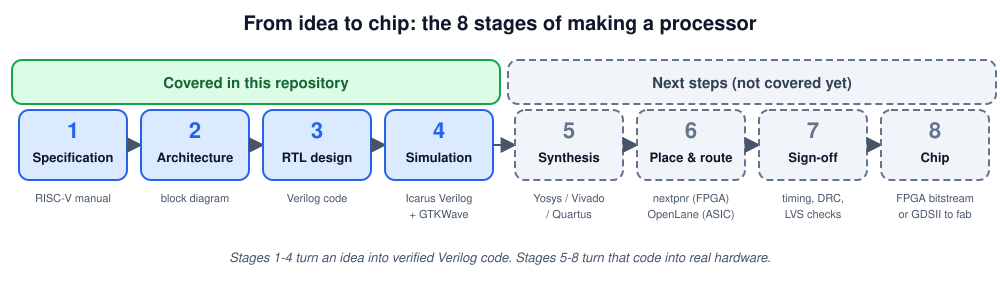
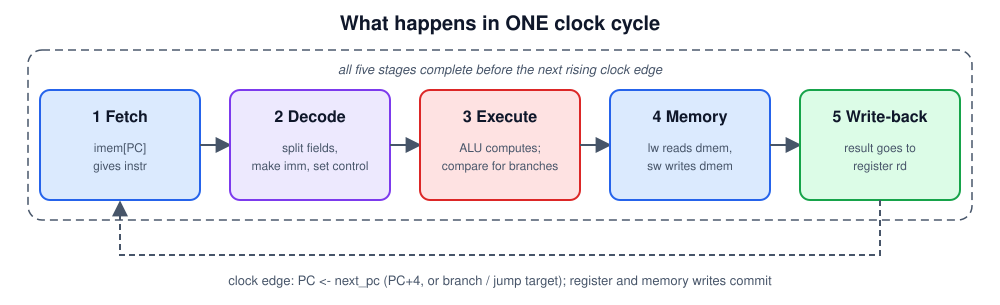
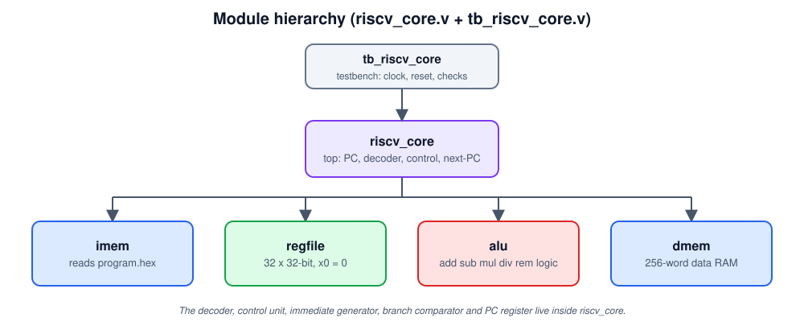
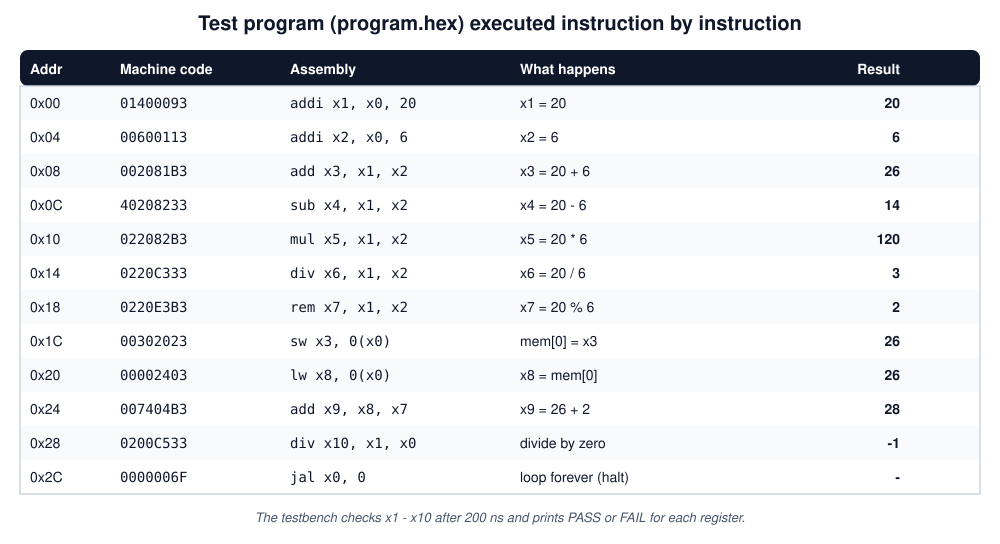

# Part 1: How a processor core is made, from idea to chip

 from the first idea to a real chip. It shows which stages this repository covers (stages 1 to 4) and what the remaining stages (5 to 8) involve.



**Contents**

1. [Stage 1: Specification](#stage-1-specification)
2. [Stage 2: Architecture](#stage-2-architecture)
3. [Stage 3: RTL design in Verilog](#stage-3-rtl-design-in-verilog)
4. [Stage 4: Simulation and verification](#stage-4-simulation-and-verification)
5. [Stage 5: Synthesis](#stage-5-synthesis)
6. [Stage 6: Place and route](#stage-6-place-and-route)
7. [Stage 7: Sign-off](#stage-7-sign-off)
8. [Stage 8: The chip](#stage-8-the-chip)
9. [Where this project stands](#where-this-project-stands)
10. [Glossary](#glossary)

---

## Stage 1: Specification

Before writing any code, decide **what** you are building. For this project the decisions were:

| Question | Decision | Why |
|---|---|---|
| Which instruction set (ISA)? | **RISC-V, 32-bit (RV32I)** | Open standard, free to use, small and clean, and widely taught |
| What should it calculate? | Add, subtract, multiply, divide, remainder | The goal was a core that can do all basic arithmetic |
| Which extension adds multiply and divide? | **M extension** | Multiply and divide are not in the base RV32I set |
| How fast per instruction? | **Single cycle**: one instruction per clock | Simplest possible control logic, easiest to understand |
| Memory? | Separate instruction and data memory, 256 words each | Simple and fits a teaching design |
| Memory access sizes? | 32-bit words only (`lw`, `sw`) | Keeps the memory logic tiny |

The ISA is the **contract** between software and hardware: it defines the instructions, their bit layouts, and what each one must do. The official RISC-V manual is the "specification" for this stage.

---

## Stage 2: Architecture

Next, decide **what blocks** the CPU is made of and how data moves between them. This is called the **microarchitecture**. A single-cycle RISC-V core needs:

* a **Program Counter (PC)** that holds the address of the current instruction,
* an **instruction memory** to fetch from,
* a **decoder and control unit** that works out what the instruction means,
* a **register file** (32 registers) to hold values,
* an **ALU** (calculator) to compute,
* a **data memory** for loads and stores,
* **next-PC logic** to handle branches and jumps.


In a single-cycle design every instruction goes through the same path once:



**Trade-off:** it is simple, but the clock period must be long enough for the slowest instruction, and multiply and divide are slow. Faster processors use a pipeline. See [Part 2](02-core-explained.md) for every block in detail.

---

## Stage 3: RTL design in Verilog

**RTL** (Register-Transfer Level) means describing hardware as "registers, and the logic between them". We write it in the hardware description language **Verilog**. Verilog is not like a normal program: every `module` is a physical block, and all blocks work **at the same time**.

There are two kinds of logic, and the code shows both:

| Kind | Verilog style | Example in this core |
|---|---|---|
| **Combinational** (output depends only on current inputs) | `assign` or `always @(*)` | the ALU, the decoder, immediate generator |
| **Sequential** (remembers state, changes on a clock edge) | `always @(posedge clk)` | the PC, the register file, data memory writes |

The modules in `rtl/riscv_core.v`:

| Module | Role |
|---|---|
| `alu` | Add, subtract, multiply, divide, remainder, logic, shifts, compares |
| `regfile` | 32 x 32-bit registers, two read ports, one write port, `x0` is always 0 |
| `imem` | Instruction memory, loaded from `program.hex` |
| `dmem` | Data memory for `lw` / `sw` |
| `riscv_core` | Top module: PC, decoder, control, immediate generator, branch logic |

A good order for writing it yourself: **ALU first** (easy to test alone), then the register file, then the memories, and finally the top module that connects everything.



---

## Stage 4: Simulation and verification

Before building any hardware, prove in software that the design behaves correctly. This is **simulation**, and it is the most important stage, because mistakes are cheap to fix here and expensive later.

You need three things, and all are in this repository:

1. **The design**: `rtl/riscv_core.v`
2. **A testbench**: `tb/tb_riscv_core.v` generates the clock and reset, runs the core, and checks the answers.
3. **A test program**: `program.hex` is machine code that the core runs.



### Run it

Install the free tools, then run from the repository folder:

```bash
# Ubuntu / Debian:  sudo apt install iverilog gtkwave
# macOS:            brew install icarus-verilog gtkwave

iverilog -g2012 -o sim rtl/riscv_core.v tb/tb_riscv_core.v
vvp sim
gtkwave core.vcd
```

Expected result: `PASS` for registers `x1` to `x10`, then `ALL TESTS PASSED`.

### What to look at in the waveform

Add these signals in GTKWave: `dut.pc`, `dut.instr`, `dut.alu_y`, `dut.reg_we`, `dut.wb_data`. You should see the PC increase by 4 every clock and the registers fill in one instruction at a time.

### How to test more thoroughly

The included program checks the basics. A stronger test should also cover:

* negative numbers in `add`, `sub`, `mul`, `div`, `rem`,
* divide by zero and the overflow case (`INT_MIN / -1`),
* every branch type, taken and not taken,
* `jal` and `jalr`, and `lui` / `auipc`,
* loads and stores at different addresses.

Professional teams also compare the core against a **golden reference model** (for example the RISC-V simulator *Spike*) and run the official `riscv-tests` suite.

---

## Stage 5: Synthesis

**Synthesis** converts RTL code into a **netlist**: a list of real logic gates (AND, OR, flip-flops...) and how they are wired. A free tool for this is **Yosys**. For an FPGA you can also use the vendor tools (Vivado for AMD/Xilinx, Quartus for Intel).

A first experiment, which prints how many gates and flip-flops the design needs:

```bash
yosys -p "read_verilog rtl/riscv_core.v; synth -top riscv_core; stat"
```

> This synthesis flow has **not** been run on this design yet. The points below are what you should expect, based on how the code is written.

**Things to fix or know before synthesis works well:**

1. **The core has no outputs.** `riscv_core` only has `clk` and `reset`. A synthesis tool removes logic that nothing can observe, so it would delete almost everything. Add an output port first (for example, a few bits of a register, or LEDs).
2. **Memories are written as plain register arrays.** On an FPGA the tool will use distributed RAM or flip-flops (the combinational read prevents block RAM). For a real chip, memories are normally separate SRAM blocks.
3. **`/` and `%` make a very large, very slow divider** in one cycle. This limits the clock speed. Real cores use a multi-cycle divider.
4. **`$readmemh` and `initial` blocks** are meant for simulation and FPGA initialisation. They do not apply to a real chip, where the program would be loaded some other way.

---

## Stage 6: Place and route

The netlist is only a list of gates. **Place and route** decides where each gate sits and draws the wires.

### FPGA route (the realistic next step)

An **FPGA** is a chip you can reprogram, so you can test your design in real hardware without manufacturing anything.

1. Pick a board (a low-cost one is enough).
2. Add a small **top-level wrapper**: clock input, reset button, and outputs such as LEDs.
3. Write a **constraints file** that maps wrapper ports to physical pins and sets the clock frequency.
4. Run the tools: Yosys with **nextpnr** (open source, supports some FPGA families such as iCE40 and ECP5), or Vivado / Quartus for their own boards.
5. The result is a **bitstream** file. Load it onto the board.

### ASIC route (a real custom chip)

An **ASIC** is a fixed chip made in a factory. Open-source flows such as **OpenLane** (built on Yosys and OpenROAD) can take Verilog all the way to a layout, using an open process kit such as **SkyWater SKY130**. The steps are floorplan, placement, clock-tree synthesis, then routing. You describe your design in a small configuration file (design name, Verilog files, clock port, clock period).

---

## Stage 7: Sign-off

Before sending a design to be made, run the final checks:

| Check | Question it answers |
|---|---|
| **Static timing analysis (STA)** | Do all signals arrive in time at the chosen clock speed? |
| **DRC** (Design Rule Check) | Does the layout obey the factory's manufacturing rules? |
| **LVS** (Layout vs Schematic) | Does the drawn layout really match the netlist? |

For an FPGA, the equivalent is the timing report from the place-and-route tool.

---

## Stage 8: The chip

* **FPGA:** you load the bitstream onto the board and your core runs in real hardware within seconds.
* **ASIC:** the final layout file (**GDSII**) is sent to a foundry. This takes months and costs real money, but small community programs such as **Tiny Tapeout** let students put tiny designs on a shared chip. Programs and prices change, so check the current details. This design, with its memories made of flip-flops, would need to be shrunk or use proper memory blocks to fit a small shared chip.

Most students and hobbyists stop at the FPGA and that is a perfectly good finish.

---

## Where this project stands

| Stage | Status |
|---|---|
| 1. Specification | Covered (RV32IM, single cycle) |
| 2. Architecture | Covered (datapath and block diagrams) |
| 3. RTL design | Covered (`rtl/riscv_core.v`) |
| 4. Simulation | Testbench and test program included. **Run it yourself** and check for `ALL TESTS PASSED` |
| 5. Synthesis | Not done. See the notes above |
| 6. Place and route | Not done |
| 7. Sign-off | Not done |
| 8. Chip | Not done |

---

## Glossary

| Term | Meaning |
|---|---|
| **ISA** | Instruction Set Architecture: the list of instructions a CPU understands |
| **RISC-V** | An open, free instruction set |
| **RTL** | Register-Transfer Level: hardware described as registers plus logic |
| **Verilog** | A language for describing hardware |
| **ALU** | Arithmetic Logic Unit: the part that calculates |
| **PC** | Program Counter: address of the current instruction |
| **Testbench** | Code that drives and checks a design in simulation |
| **Synthesis** | Turning RTL into logic gates |
| **Netlist** | The list of gates and wires produced by synthesis |
| **FPGA** | A reprogrammable chip for trying out hardware designs |
| **ASIC** | A custom chip made in a factory |
| **Bitstream** | The file that configures an FPGA |
| **GDSII** | The layout file sent to a chip factory |
| **STA / DRC / LVS** | Timing, manufacturing-rule and layout-vs-netlist checks |
| **PDK** | Process Design Kit: the factory's data needed to design for its process |

---

Next: [Part 2: The core explained in detail](02-core-explained.md)
